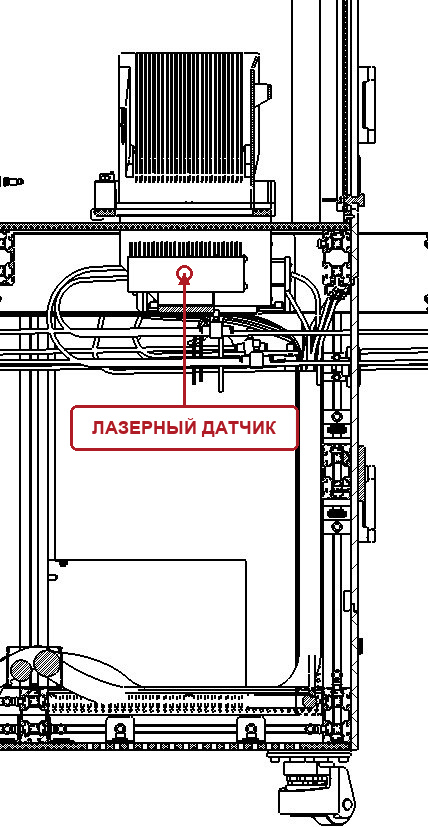
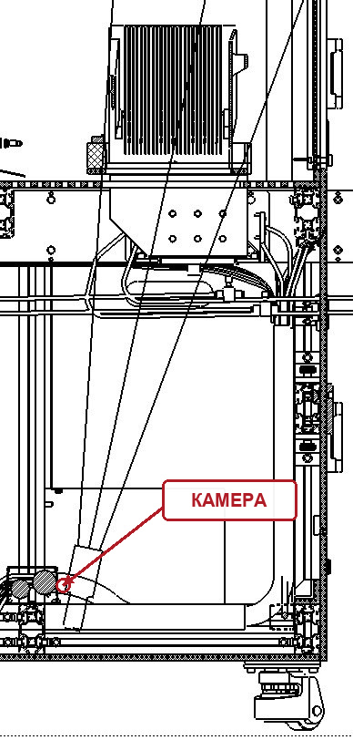
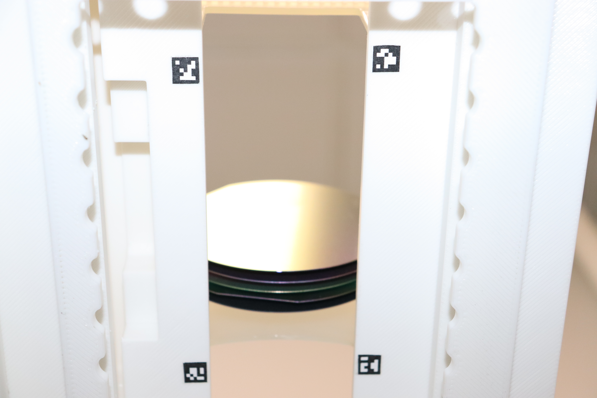
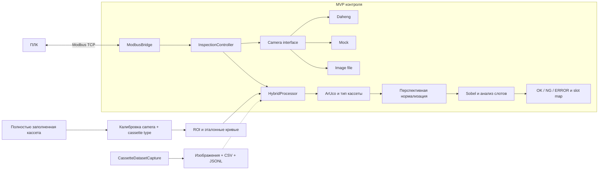
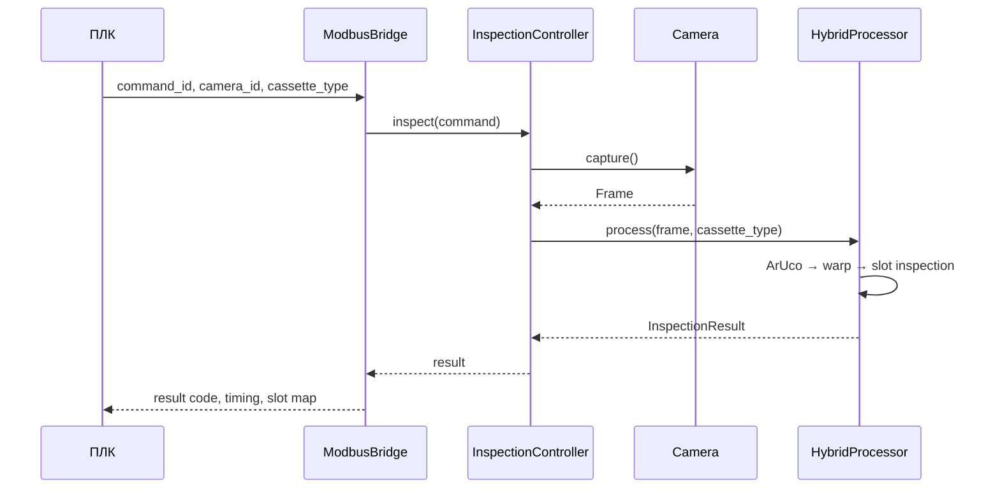

# Vision-based Wafer Cassette Inspection

MVP системы машинного зрения для контроля заполнения кассет с кремниевыми пластинами. Цель проекта — заменить точечный лазерный сенсор камерой Daheng и получать карту состояния всех слотов за один цикл измерения.


## Задача

| Исходная конфигурация: лазерный сенсор | Целевая конфигурация: камера |
| --- | --- |
|  |  |

Лазерный сенсор измеряет кассету последовательно и предоставляет ограниченный сигнал. Камера видит кассету целиком, а программная обработка позволяет:

- определить типоразмер кассеты по ArUco-маркерам;
- компенсировать перспективу и небольшое смещение камеры;
- проверить каждый слот относительно калибровочной модели;
- передать результат в ПЛК по Modbus TCP;
- собирать размеченный датасет для развития алгоритма.

## Реальный тестовый кадр



На этом снимке обнаружены четыре маркера `10–13`, тип кассеты `100 мм` и пять видимых фронтальных кромок пластин. После перспективной нормализации размер рабочего кадра составляет `1600 × 1200`.

## Архитектура



Основной поток исполнения:



## Как работает hybrid-алгоритм

1. На кадре должны присутствовать четыре ArUco `DICT_5X5_100` одного типоразмера.
2. Внутренние углы маркеров задают область перспективного преобразования.
3. Нормализованный кадр приводится к каноническому размеру.
4. Вертикальный Sobel-отклик усиливает горизонтальные фронтальные кромки пластин.
5. Для каждого слота кромка ищется около эталонной кривой, сохранённой при калибровке.
6. Сила и покрытие кромки определяют `OCCUPIED_OK` или `EMPTY`; общий результат становится `OK` или `NG`.

Маркеры кодируют тип кассеты:

| ArUco ID | Тип кассеты | Слотов по умолчанию |
| --- | ---: | ---: |
| `10–13` | 100 мм | 25 |
| `20–23` | 150 мм | 25 |
| `30–33` | 200 мм | 25 |

Числовой контракт `slot map`, общий для датасета и Modbus:

| Код | Состояние |
| ---: | --- |
| 0 | `EMPTY` |
| 1 | `OCCUPIED_OK` |
| 2 | `CROSS_SLOT` |
| 3 | `SHIFTED_IN_SLOT` |
| 4 | `DOUBLE_LOADED_SUSPECT` |
| 5 | `UNCERTAIN` |

Текущий `HybridProcessor` классифицирует только `EMPTY` и `OCCUPIED_OK`. Остальные состояния уже зарезервированы единым контрактом датасета и требуют дополнительных данных и отдельной валидации.

## Состав репозитория

```text
mvp/          Python-сервис: камеры, hybrid CV, Modbus TCP, калибровка
Dataset_app/  .NET 8 WinForms-приложение для сбора размеченного датасета
test.ipynb    исследовательский прототип алгоритма на реальном кадре
IMG_3645.JPG  тестовый кадр кассеты 100 мм
```

Подробности по компонентам находятся в [mvp/README.md](mvp/README.md) и [Dataset_app/README.md](Dataset_app/README.md).

## Быстрый старт MVP

Требуется Python 3.8+.

```powershell
python -m venv .venv
.\.venv\Scripts\Activate.ps1
python -m pip install -r .\mvp\requirements.txt
python -m pip install pytest
cd .\mvp
pytest -q
```

Запуск контейнера с Modbus TCP:

```powershell
cd .\mvp
docker compose up --build
```

В `mvp/config/config.yaml` по умолчанию включены mock-камеры. Для Daheng необходимо указать `driver: daheng`, серийные номера и предоставить совместимый пакет `gxipy`.

## Калибровка

Калибровка выполняется отдельно для каждой пары `camera_id + cassette_type_mm` и только на полностью заполненной кассете. Текущая конфигурация использует контейнерные пути, поэтому воспроизводимый вариант запуска выглядит так:

```powershell
Copy-Item C:\data\full_cassette_100.jpg .\mvp\data\full_cassette_100.jpg
cd .\mvp
docker compose run --rm kmz python -m app.calibrate `
  --camera cassette_left `
  --cassette 100 `
  --image /app/data/full_cassette_100.jpg
```

Результат сохраняется в `/app/data/` внутри контейнера и появляется в локальном `mvp/data/` через Docker volume. Рабочие модели и калибровочные данные намеренно исключены из Git.

`IMG_3645.JPG` частично заполнен, поэтому используется для smoke-test геометрии и видимых кромок, но не заменяет калибровочный кадр.

## Сбор датасета

`Dataset_app` помогает оператору последовательно собирать конфигурации кассеты и сохраняет изображения вместе с разметкой `CSV` и `JSONL`.

```powershell
cd .\Dataset_app
dotnet run --project .\src\CassetteDatasetCapture\CassetteDatasetCapture.csproj
```

Приложение поддерживает  Daheng требуется Galaxy SDK.


## Ограничения MVP

- Для проверки реального частично заполненного кадра нужна модель, полученная на полностью заполненной кассете того же типа и с той же камеры.
- Пороговые значения требуют проверки на серии снимков с разной экспозицией и механическими допусками.
- Классы перекоса, cross-slot и двойной загрузки пока присутствуют только в контракте датасета.
- Интеграция с реальной Daheng и ПЛК должна пройти приёмочные испытания на установке.
